# Entity Relationship Diagram (ERD) - ProjectZ Database

## Visual ERD Representation

```mermaid
erDiagram
    %% Master Tables
    MstAkses {
        BIGINT id PK "Auto-increment"
        VARCHAR nama "Access role name (50)"
        VARCHAR deskripsi "Description (255)"
        BIGINT created_by "Audit field"
        DATETIME created_date "Audit field"
        BIGINT modified_by "Audit field"
        DATETIME modified_date "Audit field"
    }

    MstUser {
        BIGINT id PK "Auto-increment"
        BIGINT id_akses FK "Reference to MstAkses"
        VARCHAR username "Unique username (16)"
        VARCHAR password "Hashed password (64)"
        VARCHAR nama_lengkap "Full name (70)"
        VARCHAR email "Unique email (256)"
        VARCHAR no_hp "Phone number (18)"
        VARCHAR alamat "Address (255)"
        DATE tanggal_lahir "Birth date"
        BIT is_registered "Registration status"
        VARCHAR otp "OTP code (64)"
        VARCHAR token_estafet "Token (64)"
        VARCHAR link_image "Image URL (256)"
        VARCHAR path_image "Image path (256)"
        BIGINT created_by "Audit field"
        DATETIME created_date "Audit field"
        BIGINT modified_by "Audit field"
        DATETIME modified_date "Audit field"
    }

    MstGroupMenu {
        BIGINT id PK "Auto-increment"
        VARCHAR nama "Group name (50)"
        VARCHAR deskripsi "Description (255)"
        BIGINT created_by "Audit field"
        DATETIME created_date "Audit field"
        BIGINT modified_by "Audit field"
        DATETIME modified_date "Audit field"
    }

    MstMenu {
        BIGINT id PK "Auto-increment"
        BIGINT id_group_menu FK "Optional reference to MstGroupMenu"
        VARCHAR nama "Menu name (50)"
        VARCHAR path "Menu path (50)"
        VARCHAR deskripsi "Description (255)"
        BIGINT created_by "Audit field"
        DATETIME created_date "Audit field"
        BIGINT modified_by "Audit field"
        DATETIME modified_date "Audit field"
    }

    MstKategoriProduk {
        BIGINT id PK "Auto-increment"
        VARCHAR nama_produk "Category name (50)"
        VARCHAR deskripsi "Description (255)"
        VARCHAR notes "Additional notes (255)"
        DATETIME created_at "Creation timestamp"
        BIGINT created_by "Creator user ID"
        DATETIME modified_at "Modification timestamp"
        BIGINT modified_by "Modifier user ID"
    }

    MstProduk {
        BIGINT id PK "Auto-increment"
        BIGINT id_kategori_produk FK "Reference to MstKategoriProduk"
        VARCHAR nama_produk "Product name (50)"
        VARCHAR merk "Brand (50)"
        VARCHAR model "Model (50)"
        VARCHAR warna "Color (30)"
        VARCHAR deskripsi_produk "Product description (255)"
        INT stok "Stock quantity"
        DATETIME created_at "Creation timestamp"
        BIGINT created_by "Creator user ID"
        DATETIME modified_at "Modification timestamp"
        BIGINT modified_by "Modifier user ID"
    }

    MstSupplier {
        BIGINT id PK "Auto-increment"
        VARCHAR nama_supplier "Supplier name (50)"
        VARCHAR alamat_supplier "Supplier address (255)"
        DATETIME created_at "Creation timestamp"
        BIGINT created_by "Creator user ID"
        DATETIME modified_at "Modification timestamp"
        BIGINT modified_by "Modifier user ID"
    }

    %% Mapping Tables (Many-to-Many)
    MapAksesMenu {
        BIGINT id_akses PK,FK "Reference to MstAkses"
        BIGINT id_menu PK,FK "Reference to MstMenu"
    }

    MapProdukSupplier {
        BIGINT id_produk PK,FK "Reference to MstProduk"
        BIGINT id_supplier PK,FK "Reference to MstSupplier"
    }

    %% Audit Log Tables
    LogKategoriProduk {
        BIGINT id PK "Auto-increment"
        BIGINT id_kategori_produk "Original category ID"
        VARCHAR nama_produk "Category name snapshot (50)"
        VARCHAR deskripsi "Description snapshot (255)"
        VARCHAR notes "Notes snapshot (255)"
        CHAR flag "Operation flag (1)"
        DATETIME created_at "Log timestamp"
        BIGINT created_by "User who made change"
    }

    LogProduk {
        BIGINT id PK "Auto-increment"
        BIGINT id_produk "Original product ID"
        BIGINT id_kategori_produk "Category ID snapshot"
        VARCHAR nama_produk "Product name snapshot (50)"
        VARCHAR merk "Brand snapshot (50)"
        VARCHAR model "Model snapshot (50)"
        VARCHAR warna "Color snapshot (30)"
        VARCHAR deskripsi_produk "Description snapshot (255)"
        INT stok "Stock snapshot"
        CHAR flag "Operation flag (1)"
        DATETIME created_at "Log timestamp"
        BIGINT created_by "User who made change"
    }

    LogSupplier {
        BIGINT id PK "Auto-increment"
        BIGINT id_supplier "Original supplier ID"
        VARCHAR nama_supplier "Supplier name snapshot (50)"
        VARCHAR alamat_supplier "Address snapshot (255)"
        CHAR flag "Operation flag (1)"
        DATETIME created_at "Log timestamp"
        BIGINT created_by "User who made change"
    }

    %% Relationships
    %% One-to-Many Relationships
    MstAkses ||--o{ MstUser : "1:N via id_akses"
    MstGroupMenu ||--o{ MstMenu : "1:N via id_group_menu (optional)"
    MstKategoriProduk ||--|| MstProduk : "1:N via id_kategori_produk"

    %% Many-to-Many Relationships
    MstAkses ||--o{ MapAksesMenu : "1:N"
    MstMenu ||--o{ MapAksesMenu : "1:N"
    MstProduk ||--o{ MapProdukSupplier : "1:N"
    MstSupplier ||--o{ MapProdukSupplier : "1:N"

    %% Audit Relationships (Logical, not enforced by FK)
    MstKategoriProduk ||..o{ LogKategoriProduk : "1:N audit trail"
    MstProduk ||..o{ LogProduk : "1:N audit trail"
    MstSupplier ||..o{ LogSupplier : "1:N audit trail"
```

## Diagram Legend

### Relationship Types
- **Solid Line (||--||)**: One-to-One relationship
- **Solid Line (||--o{)**: One-to-Many relationship  
- **Dotted Line (||..o{)**: Logical relationship (audit trail, no FK constraint)

### Key Indicators
- **PK**: Primary Key
- **FK**: Foreign Key
- **PK,FK**: Composite Primary Key that is also a Foreign Key

### Entity Categories
1. **Master Tables**: Core business entities (MstAkses, MstUser, MstGroupMenu, MstMenu, MstKategoriProduk, MstProduk, MstSupplier)
2. **Mapping Tables**: Many-to-many relationship bridges (MapAksesMenu, MapProdukSupplier)
3. **Audit Tables**: Change tracking and history (LogKategoriProduk, LogProduk, LogSupplier)

## Database Schema Information
- **Database**: H2 (development), MySQL (production)
- **Schema**: projectz
- **ORM**: JPA/Hibernate with Spring Data
- **Naming Convention**: snake_case (database) / camelCase (Java entities)
- **Primary Keys**: BIGINT with auto-increment (IDENTITY)
- **Audit Pattern**: Mixed approach with Auditable base class and individual audit fields